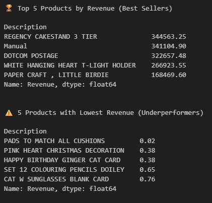

[🇧🇷 Para a versão em português, clique aqui.](./LEIA-ME.md)

---

# Project 7: E-commerce Product Performance Diagnosis

## 🎯 Business Objective
The goal of this project is to analyze a large transactional dataset from an e-commerce company to identify the top 5 best-performing and bottom 5 worst-performing products by total revenue. This analysis aims to provide actionable recommendations for inventory management and marketing strategies.

## 📚 Libraries and Concepts Used
-   **Library:** `Pandas`
-   **Key Concepts:**
    -   Data Cleaning (`.dropna()`, `.loc[]` filtering)
    -   Feature Engineering (Creating a `Revenue` column)
    -   Data Aggregation with `.groupby()`
    -   Ranking and Sorting with `.sort_values()`
    -   Handling large datasets (>1M rows)

## 📖 Process Description
1.  **Data Cleaning:** The original dataset contained invalid entries, such as transactions with negative quantities (returns), zero prices, and rows with no product description. A cleaning pipeline was executed to filter out these inconsistencies and ensure the quality of the analysis.
2.  **Feature Engineering:** A new column, `Revenue`, was created by multiplying the `Quantity` by the `Price` for each transaction.
3.  **Aggregation:** The cleaned DataFrame was grouped by product (`Description`), and the total revenue for each product was calculated using `.sum()`.
4.  **Ranking:** The final aggregated data was sorted to identify the top 5 and bottom 5 products by revenue.

## 📊 Results & Insights
The analysis successfully identified the best-selling products, which are key drivers of revenue, as well as the underperforming products that may be consuming valuable inventory space.

**Recommendation:**
-   **Top 5:** Ensure these products are always in stock and consider them for featured marketing campaigns.
-   **Bottom 5:** Evaluate if these products should be discontinued or included in a clearance sale to optimize inventory.

## 💡 Conclusion
This project demonstrates a complete, end-to-end analytical workflow: from handling a large, messy, real-world dataset to producing a clear, data-driven business recommendation. It showcases the power of Pandas to efficiently process and aggregate data to extract valuable insights.

## 💾 Data Source
The dataset used in this analysis is the "Online Retail II UCI" dataset. It can be downloaded from Kaggle via the following link:
[https://www.kaggle.com/datasets/mashlyn/online-retail-ii-uci](https://www.kaggle.com/datasets/mashlyn/online-retail-ii-uci)